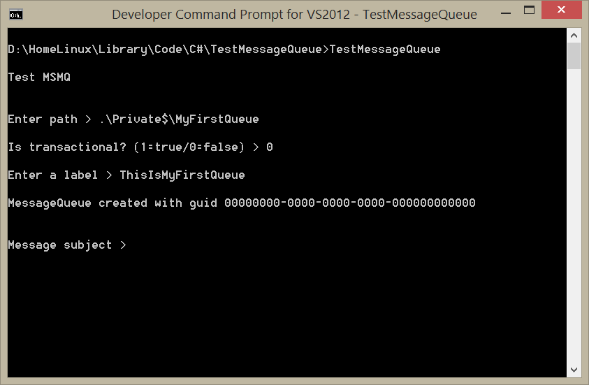
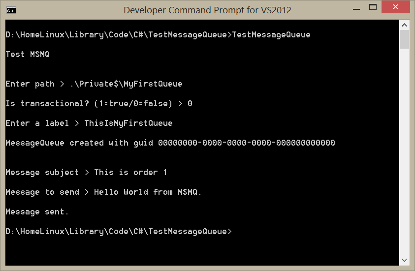
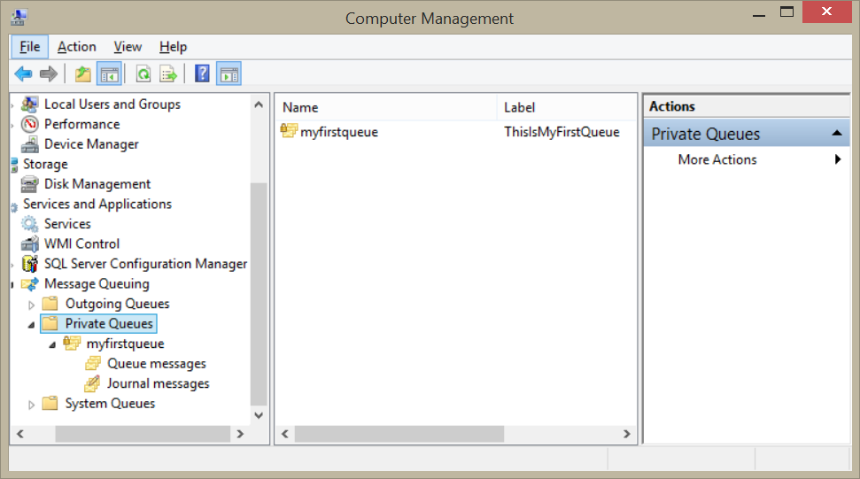
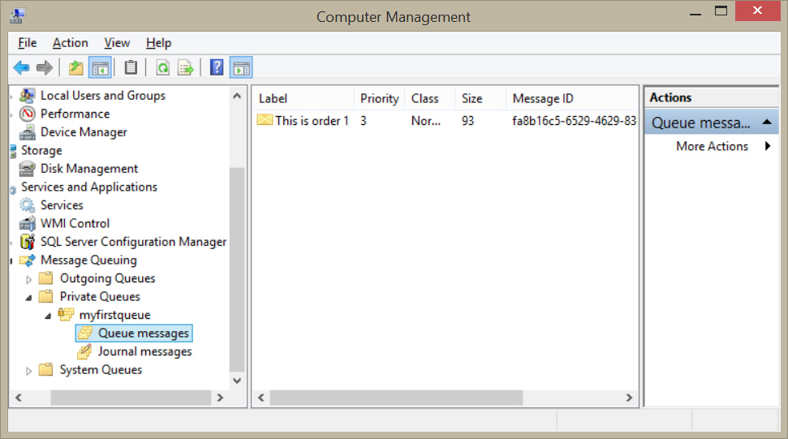
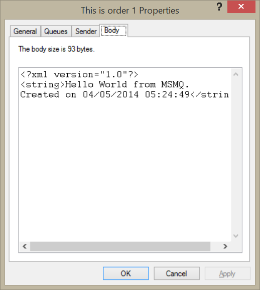

# Utilizando Message Queue con C# en .NET

Microsoft Message Queue (MSMQ) es un servicio de Windows que permite la comunicación interproceso entre diferentes computadoras de forma asíncrona,  entender cómo funciona puede resultar útil en cualquier momento que los clientes y los servidores no tengan una conexión disponible, ya que los mensajes entre ellos son encolados para su transmisión hasta que ambos estén conectados.

El funcionamiento básico de MSMQ es parecido al de una mensajería entre aplicaciones de software, una aplicación prepara un mensaje y lo escribe hacia una línea de espera o cola de mensajes MSMQ. En este contexto una cola de mensajes es un área de almacenamiento temporal que guarda los mensajes hasta que sean transmitidos. El administrador de colas actúa como un intermediario que transmite el mensaje desde su aplicación origen hasta su destino. El propósito de la cola de mensajes MSMQ es el enrutamiento y garantizar la entrega del mensaje, en caso de que el destinatario del mensaje no esté disponible la cola de mensajes mantendrá el mensaje hasta que pueda ser entregado con éxito.

Este mecanismo de transporte proporciona los siguientes beneficios:
<ol>
<li><b>Robustez:</b> Los mensajes son almacenados en la línea de espera hasta que son procesados. Si se cae la conexión entre un cliente y un server los mensajes se guardan hasta que una conexión este presente.</li>
<li><b>Mensajería basada en prioridad:</b>Los mensajes más importantes son los primeros en ser recibidos, después los mensajes que le siguen y así sucesivamente, hasta que los últimos son los de prioridad más baja.</li>
<li><b>Garantía de entrega:</b>Cuando se llaman los mensajes a través de la red, MSMQ utiliza una transacción para entregar los mensajes, si se lee un mensaje de la línea de espera y ocurre un error se hace un rollback y el mensaje regresa a la línea de espera.</li>
<li><b>Seguridad:</b> La tecnología de MSMQ utiliza la seguridad de Windows para proporcionar el control de acceso, la auditoría, encriptación y autenticación de mensajes, de hecho el ensamblado <b>System.Messaging</b> es un wrapper para una API nativa.</li>
</ol>

Hay tres tipos de líneas de espera en MSMQ: 
<ol>
<li><b>Públicas:</b> están registradas en el Active Directory y permiten a todas las maquinas enviar y recibir mensajes a través de la red.</li>
<li><b>Privadas:</b> solo se crean en la máquina local y pueden ser únicamente accedidas desde otra máquina si se conocen los nombres exactos de la máquina y de la línea de espera.</li>
<li><b>Sistema:</b> son principalmente utilizadas para propósitos administrativos o para aplicaciones que necesitan una línea de espera que guarde copias de los mensajes que son procesados, por ejemplo las aplicaciones de auditoría.</li>
</ol>

Como ejemplo de la utilización de <b>MS Message Queue</b> con C#, hice el siguiente programa que consta de dos clases: <b>MessageQueueHelper</b> y <b>TestMessageQueue</b>, la primera clase tiene los métodos para crear la cola (CreateQueue), enviar mensaje (SendMessage) y recibir mensaje (GetMessage), la segunda clase  es un programa que muestra el uso de los métodos (CreateQueue) y (SendMessage).

Al ejecutar el programa solicitará los siguientes parámetros:
<ul>
<li><tt><i>Path:</i></tt> Es el nombre de la cola de espera.</li>
<li><tt><i>Is transactional:</i></tt> 1 si la cola es transaccional, 0 si no lo es.</li>
<li><tt><i>Label:</i></tt> Identificador de la cola.</li>
</ul>

 

Al crearse la cola de mensajes el programa regresará el identificador: <b>00000000−0000−0000−0000−000000000000</b> por tratarse de una cola de mensajes privadas <i>(private MSMQ)</i>.

Ahora el programa solicitará el título y el cuerpo del mensaje, después lo enviará hacia la cola de mensajes creada.

 

Para ver la cola de mensajes creada con el programa y el mensaje enviado, ejecutamos <i>Computer Management</i> de Windows que se encuentra en la ruta Control <i>Panel\System and Security\Administrative Tools</i> y debajo del nodo de <i>Services and Applications</i> veremos el nodo <i>Private Queues</i> debajo del nodo <b>Message Queuing</b> donde se encuentra la línea de espera creada con el programa de ejemplo.

 

Debajo de la cola de espera <b>myfirstqueue</b>, se encuentra la carpeta <b>Queue messages</b> en donde se puede ver la etiqueta del mensaje.

 

Si hacemos doble click en el mensaje aparecerá una ventana con cuatro pestañas en donde podemos ver las propiedades del mensaje, en la pestaña body podemos ver el contenido del mensaje.

